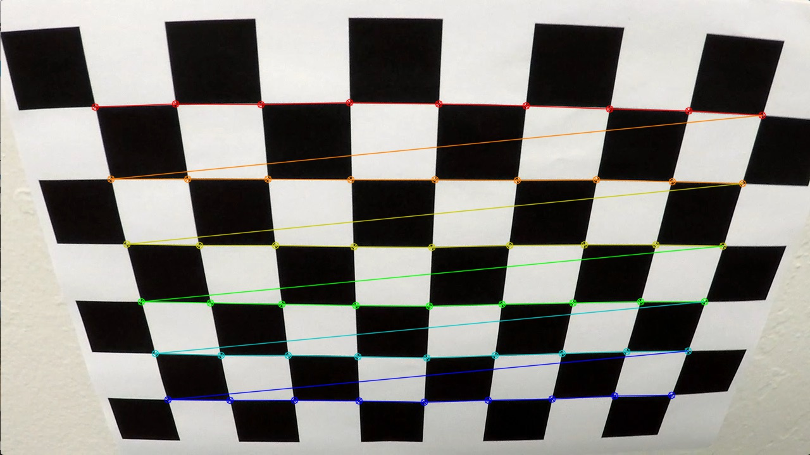
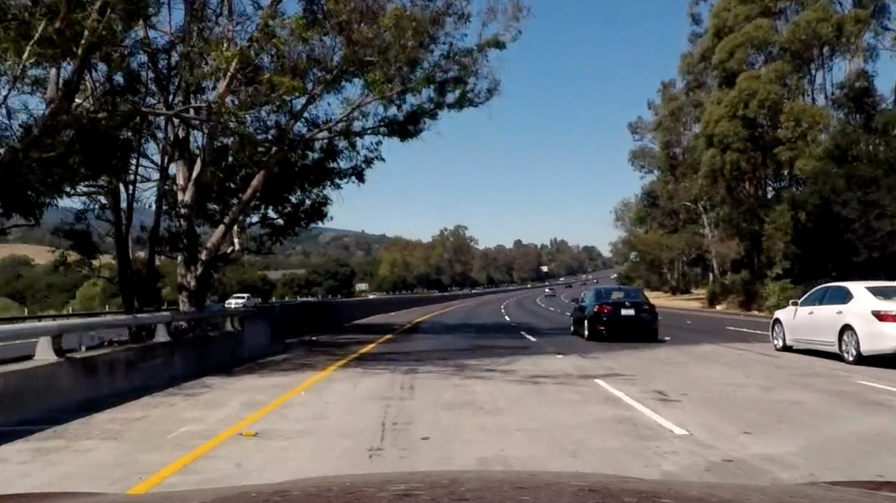
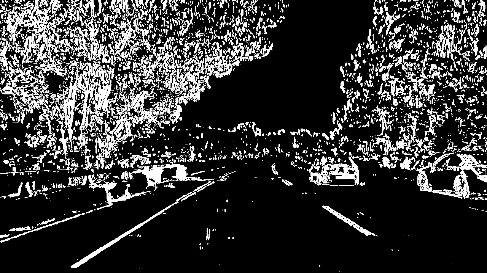
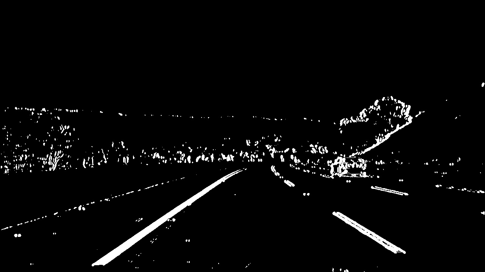
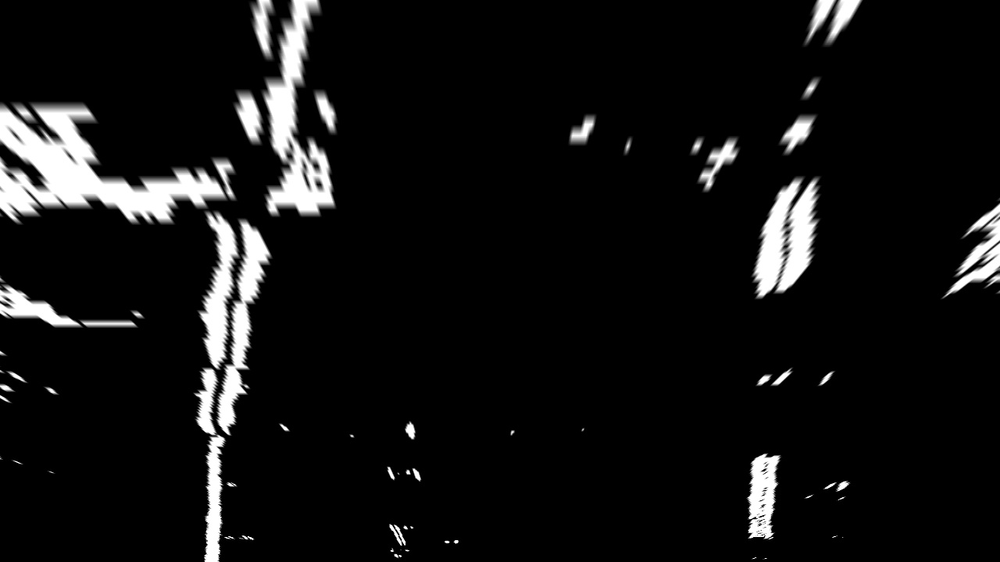
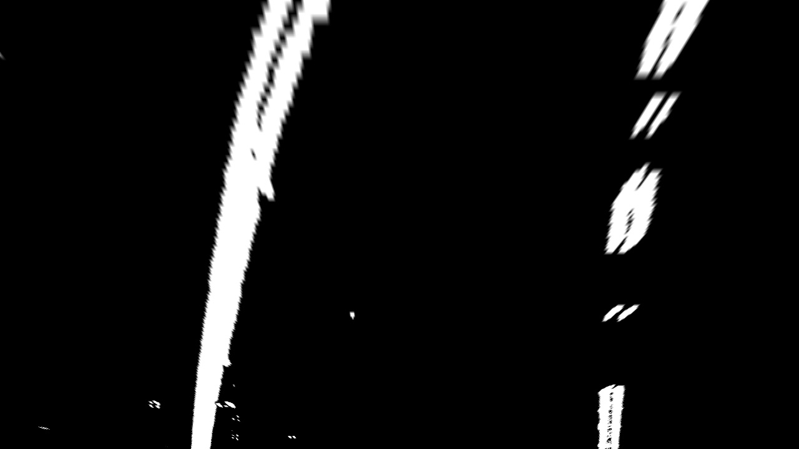
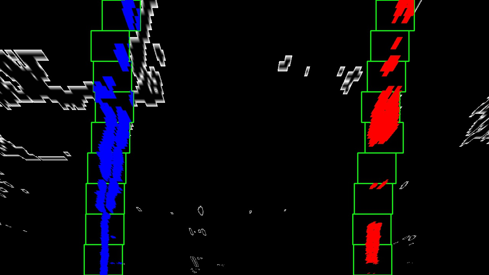
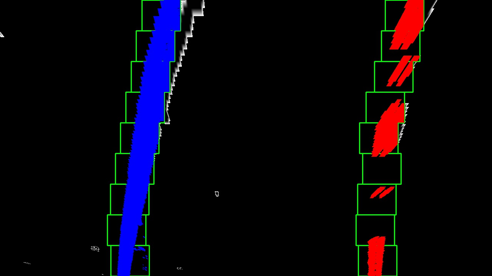
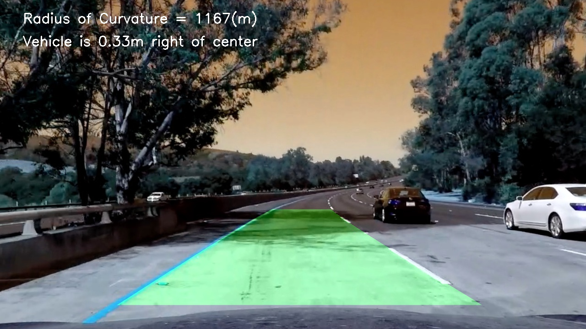
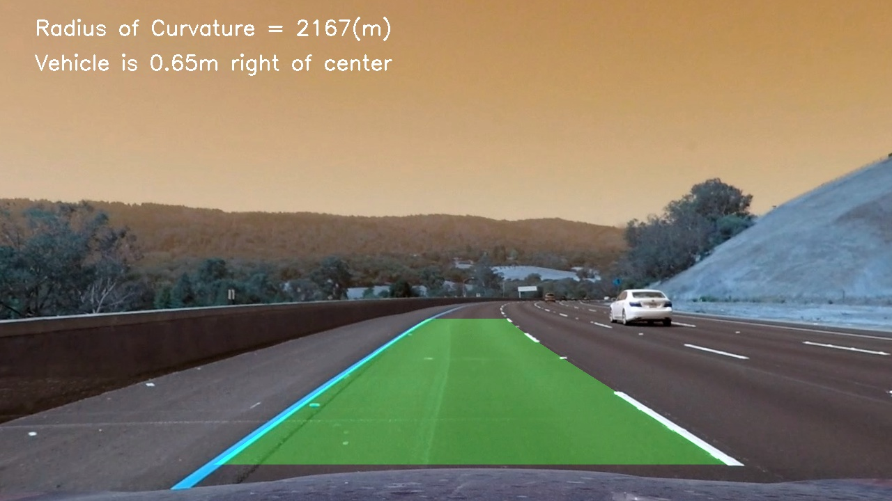

## **Project Goals** 

**The goals of this project are the following**
* Compute the camera calibration matrix and distortion coefficients given a set of chessboard images.
* Apply a distortion correction to raw images.
* Use color transforms, gradients, etc., to create a thresholded binary image.
* Apply a perspective transform to rectify binary image ("birds-eye view").
* Detect lane pixels and fit to find the lane boundary.
* Determine the curvature of the lane and vehicle position with respect to center.
* Warp the detected lane boundaries back onto the original image.
* Output visual display of the lane boundaries and numerical estimation of lane curvature and vehicle position.

## Pipeline

### Camera Calibration

The first step of this project was to calculate the Camera Matrix and the Distortion Coefficients, sample chessboard images provided were used - the corners of the chessboards were mapped using 3D object points to 2D image points (assumption: that the chessboard is flat). Chessboard corners were then found and drawn using OpenCV's cv2.findChessboardCorners() and cv2.drawChessboardCorners().

|Sample Chessboard Image   |Chessboard image with corners drawn   |
|:------------------:|:--------------------:|
|  |  |

The Camera Matrix and the Distortion Coefficients was then calculated using cv2.calibrateCamera(), and saved as a pickle file. The code to achieve this can be found in the file cam_cal.py.

### Undistort and Apply Threshold

The Camera Matrix and Distortion Coefficients were used to undistort the test images using cv2.undistort().

|Distorted Image   |Undistorted Image   |
|:------------------:|:--------------------:|
|  |  |

The following threshloding combination was applied to the undistored images:
* (Sobelx OR S_Channel OR R_Channel

|Binary Image   |Binary Image   |
|:------------------:|:--------------------:|
|  |  |

### Perspecive Transform

The source and destination co-ordinates used for perspective transform are:

|Source   |Destination   |
|:--------:|:-----------------:|
|[293, 668]  |[310, img_size[1]] |
|[587, 458]  |[310, 0]           |
|[703, 458]  |[950, 0]           |
|[1028, 668] |[950, img_size[1]] |

The below OpenCV funstions were used to generated the warped image
 * M = cv2.getPerspectiveTransform(src,dst)
 * Minv = cv2.getPerspectiveTransform(dst,src)
 * warped = cv2.warpPerspective(out_img, M, img_size, flags=cv2.INTER_LINEAR)

|Warped Image   |Warped Image   |
|:------------------:|:--------------------:|
|  |  |

### Identifying Lane-Lines and Fit Polynomial

To identify Lane Lines the warped image was divided horizontally into two halves and a sliding window technique was used for the first frame - once the left and right 'x' indices were identified for the first frame, these were then used as starting points for the consecutive frames to fit a 2nd degree polynomial.

A sanity check was then done to verify whether the lines identified were parralel, then a smoothing factor of 3 was applied over the reliable left and right coeffecients.

|Lane Lines   |Lane Lines   |
|:------------------:|:--------------------:|
|  |  |

### Determine the curvature

The curvature was measured as:

* curve_fit_cr = np.polyfit(np.array(res_yvals, np.float32)*ym_per_pix, np.array(leftx, np.float32)*xm_per_pix, 2)
* curverad = ((1+(2*curve_fit_cr[0]*yvals[-1]*ym_per_pix + curve_fit_cr[1])**2)**1.5) / np.absolute(2*curve_fit_cr[0])

where:

* ym_per_pix = 30/720
* xm_per_pix = 3.7/700

|Curved Lines  |Curved Lines   |
|:------------------:|:--------------------:|
|  |  |

## Output Video

The output video can be downloaded from: https://github.com/basurohan/CARND/blob/master/CarND-Advanced-Lane-Lines/output_video.mp4

OR

Can be viewed at: https://youtu.be/wXVpLvesYOE

## Discussion

Implemetation for this project was centered around the test video provided, I would say the techniques applied such as:

* Thresholding
* Perspective Transform
* Smoothing and Sanity Check
* Measuring the curvature

are quite robust, but an argument can be made that a deep learning approach maybe better. Scenarios where this algorithm will fail: single carraigeway or roads with no lane lines.
