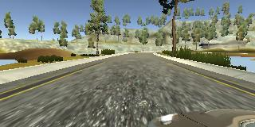
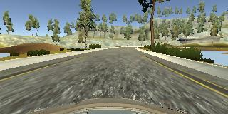
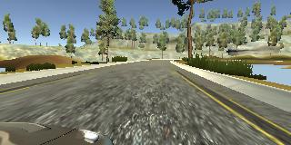
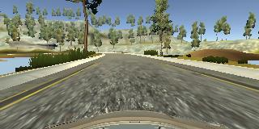

## **Project Goals** 

**The goals of this project are the following**
* Use the simulator to collect data for good driving behavior.
* Design, train and validate a model (in Keras) that predicts a steering angle from image data.
* Implement a generator to effeciently load batches.
* Use the model to drive the vehicle autonomously around the first track in the simulator.

## Dataset
Obtaining 'good' training data was the key to this project. Although I did collect data driving around the track couple of times, but the network trained better with the sample dataset provided by Udacity - hence it was used for this project.

Some general statistics on the Dataset
* Total number of frames captured: 8036
* Sample Left, Center and Right camera images

|Left camera image   |Center camera image   |Right camera image   |
|:------------------:|:--------------------:|:-------------------:|
|  |  | |             |

* 80:20 split was then applied to sample data

|Dataset   |Number of images   |
|:--------:|:-----------------:|
|Training  |6,429              |
|Validation|1,607              |

## Data Preprocessing

**The following preprocessing steps are applied to Training and Validation data**

Below preprocessing steps were applied to the data in the generator
* The Left, Center and Right images are read separately and then appended to images array.
* Corresponding steering angles are appended to measurements array.
* A correction_factor of 0.2 is applied to the Left and Right images: Left_image + correction_factor; Right_image - correction_factor.
* The dataset is then augmented with a flipped version of each image and steering angle.

The below two steps were then applied to the data in the model using Keras.
* A normalisation is then to each image: (x/255) - 0.5
* The image is then cropped (70 rows from top and 25 rows from bottom) - selecting the track as the region of interest.

|Original image   |Flipped image   |
|:---------------:|:--------------:|
|  |  |

## Model Architecture

The model for this project is based on NVIDIA's end-to-end model: https://devblogs.nvidia.com/parallelforall/deep-learning-self-driving-cars/.

**It consists of the following layers.**

| **Layer**         		|
|:---------------------:|
| Lambda layer for normalisation - (x: x / 255 - 0.5), input_shape=(160,320,3) |
| Cropping2D -  cropping=((70, 25), (0, 0)) | 
| Convolution 24x5x5 - padding: same, strides: 2x2, activation: relu | 
| Convolution 36x5x5 - padding: same, strides: 2x2, activation: relu | 
| Convolution 48x5x5 - padding: same, strides: 2x2, activation: relu | 
| Convolution 64x3x3 - padding: same, strides: 1x1, activation: relu | 
| Convolution 64x3x3 - padding: same, strides: 1x1, activation: relu | 
| Flatten 				|
| Fully connected (100)	|
| Fully connected (50)	|
| Fully connected (10)	|
| Fully connected (1)	|

* Loss function: mean squared error
* Optimizer: adam

## Approach taken for deriving the model

**Initial approach:**

The below architecture based on the LeNet model was first used:

Input => Normalize => Crop => Convolution => RELU => MaxPool => Convolution => RELU => MaxPool=> Dense => RELU => Dense

Loss: MSE, Optimizer: Adam

The above model was trained for 5 epochs, but the validation loss plateaued after 3 epochs - so the model was re-trained for 3 epochs. On running the simulator the car was able to drive itself on the straight bits of the curve but performed poorly at the corners. 

The model was re-trained by adding dropout in-between the Dense layers, but with no improvement.

**Final approach**

As suggested in the module, NVIDIA's end-to-end model was implemented with MaxPooling between the Convolutional layers and Dropout betweeen the Dense layers, but it did not show much improvement - as the car still deviated away from the track in the final corners.

After removing the MaxPooling and Droput layers and re-training the model for 3 epochs the car could finally drive itself around the track.

