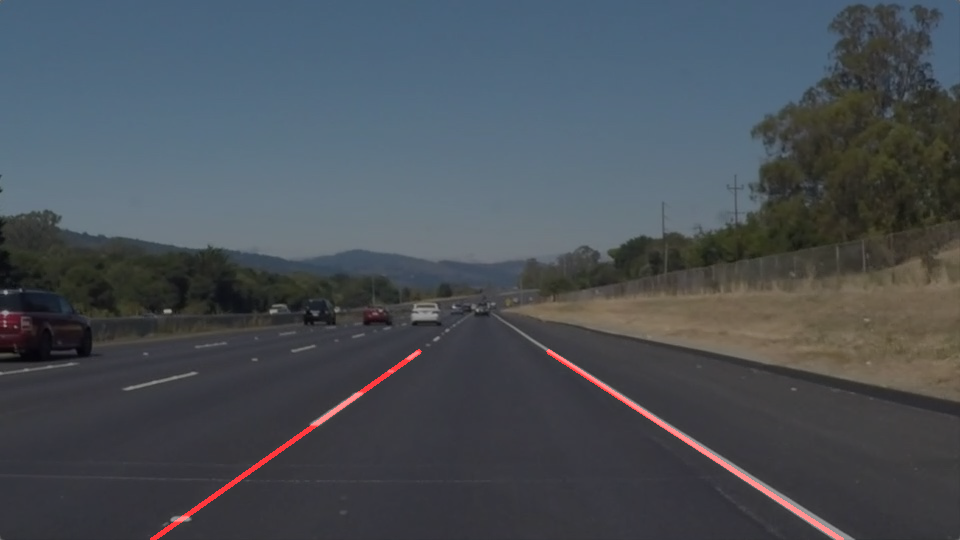
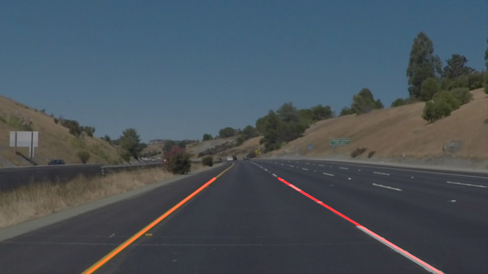
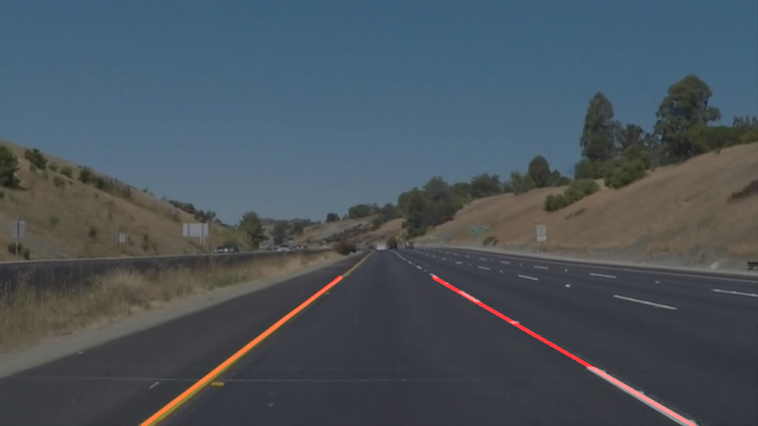

## Project Goals

**The goals of this project are the following:**
* Make a pipeline that finds lane lines on the road.
* Reflect on the work in a written report.

## Pipeline
**Following steps were taken to meet project goals**
1. Read images from directory and convert to grayscale using OpenCV's - cv2.grayscale().
2. Apply Gaussian Blur to the grayscale image using OpenCV's - cv2.GaussianBlur(); Kernel size used = 5.
3. Detect edges using OpenCV's canny edge detection - cv2.Canny(); with 1:3 Threshod ratio (70-210).
4. Apply region masking:

   A polygon of 4 co-ordinates are selected based on test images provided; these vertices are then passed to the region_of_interest method along with the output from canny edge detection. A blank copy of the image is created on which the lines are drawn as per the vertices and then futher masked onto the image by applying bitwise_and operation.

5. Hough transformation is then applied to the masked image. Hough parameters used:
   * rho = 2
   * theta = pi/180
   * threshold = 20
   * min_line_len = 60 
   * max_line_gap = 30
6. Final result is obtained by adding the hough transformed image to the original image using OpenCV's - cv2.addweighted().

**Modification of draw_lines() function**
>Draw lines function is modified to calculate the slope of each line; based on a threshold of +0.5 (left) and -0.5 (right), it is determined whether the line is for the left / right lane. Average slope, mean x and y values are calculated for all lines, this done the extrapolated x-values (left and right) is calculated as per: (y - Y) = M(x - X).

**Sample image outputs**
* _Other image outputs can be viewed in the repository folder - test_iamges_output_
* _Video clips can be downloaded from test_videos_output_ 

  

## Potential shortcomings / possible improvements

1. This pipeline is only tested against the test_images and test_videos, further testing needs to be conducted on a larger dataset.

2. As evidenced by the challenge video, this pipeline needs to be improved to handle curves more effeciently.

3. Also, it is to be seen how effective this pipeline is for inner suburban roads with roun-abouts and T-junctions.

