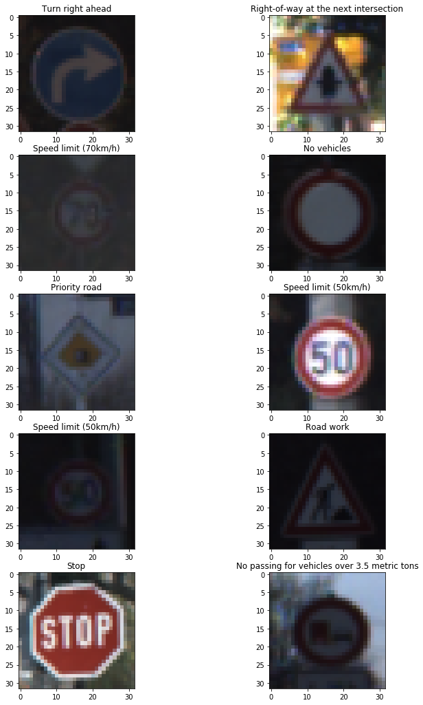
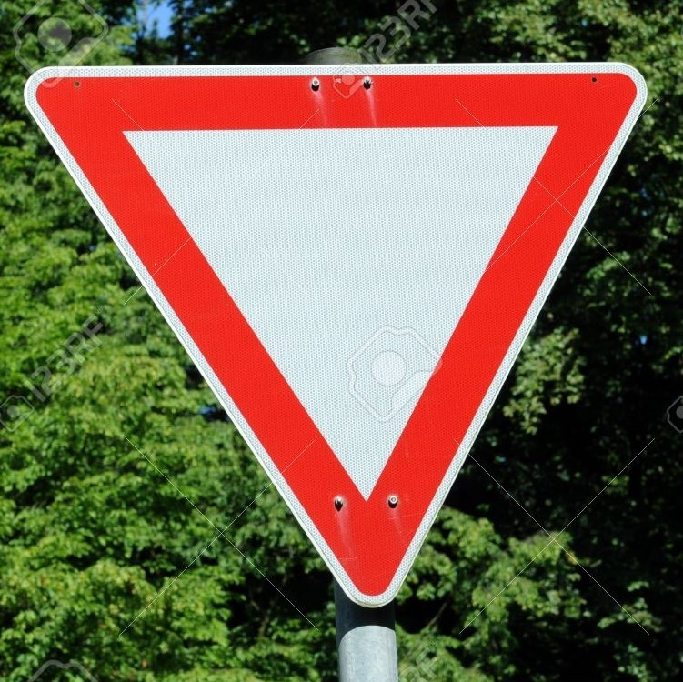
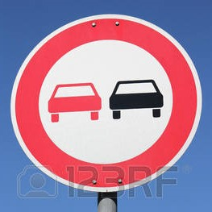
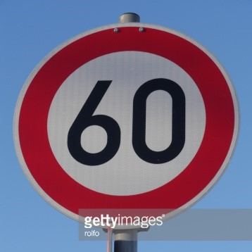
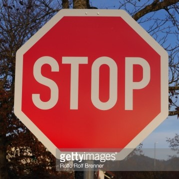
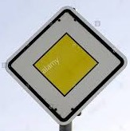
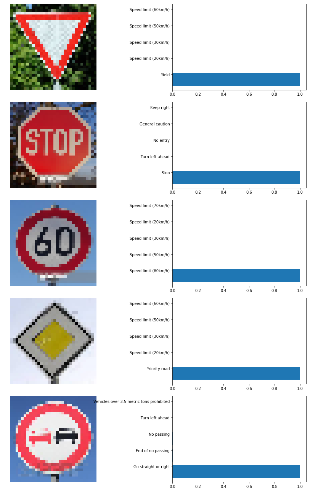

## **Project Goals** 

**The goals of this project are the following**
* Build a Traffic Sign Recognition Classifier.
* Load, explore, summarize and visualize the data set.
* Design, train and test a convolutional neural network model architecture.
* Use the trained model to make predictions on new images from the web.
* Analyze the softmax probabilities of the new images.

## Dataset
* Training, Validation and Test images were used from the German Traffic Sign dataset.
* Number of immages in each set:

|Dataset   |Number of images   |
|:--------:|:-----------------:|
|Training  |34,799             |
|Validation|4,410              |
|Test      |12,630             |

* Image data shape = 32x32x3
* Number of classes = 43

**Sample input images**

## Preprocessing
**Following preprocessing steps were applied to input images**
* First input image is converted to grayscale using OpenCV.
* Then the image is normalized between 0 to 1.
* Finally the image is reshaped as 32x32x1.

## Model Architecture
**My final model consisted of the following layers:**

| Layer         		|     Description	        					| 
|:---------------------:|:---------------------------------------------:| 
| Input         		| 32x32x1 grayscale image   							| 
| Convolution 5x5     	| 1x1 stride, valid padding, outputs 28x28x6 	|
| Max pooling	      	| 2x2 stride, 2x2 kernel, valid padding, outputs 14x14x6 				|
| Convolution 5x5	    | 1x1 stride, valid padding, outputs 10x10x16 |
| Max pooling	      	| 2x2 stride, 2x2 kernel, valid padding, outputs 5x5x16 				|
| Fully connected		| input 400(flattened), output 120		|
| Fully connected		| input 120, output 84		|
| Fully connected		| input 84, output 43		|
| Softmax				| top 5 probabilities analysed		|

**Training hyperparameters**
  * Epochs: 60
  * Batch size = 128
  * Learning rate = 0.001
  * Optimizer = AdamOptimizer
  
`Validation accuracy achieved: 0.940`

`Testing accuracy achieved: 0.924`

**Approach taken for finding a solution and getting the validation set accuracy to be at least 0.93.**

`The LeNet architecture was used as a baseline model to achieve the above.`

**Initial approach:**
* Preprocessing:
  * Normalise image.
* Train the model with non-linear activations=ReLu's (in between each layer)
* Hyperparameters used:
  * Epochs: 25 - 30
  * Batch size = 128
  * Learning rate = 0.001
  * Dropout = train: 0.5, validation/test: 1.0

**NOTE:** My initial approach did not involve converting images to grayscale - this did not achieve the required accuracy of 93%. I then added dropout (0.5 - training, 1.0 - validation / test) after the 1st and the 2nd fully connected layers, but with not much improvement.

**Final approach:**
* Preprocessing:
  * Convert image to grayscale.
  * Normalise image.
* Train the model without non-linear activations=ReLu's (in between each layer)
* Hyperparameters used:
  * Epochs: 60
  * Batch size = 128
  * Learning rate = 0.001

**NOTE**: Conversion to grayscale was introduced in the preprocessing step prior to normalisation, this did improve the performace but the accuracy hovered around late 80's. Then I removed the non-linearityin the model, by commenting out the ReLu's and the dropout's and finally after training the model for 60 epochs accuracy of 94% was obtained.

## Model was then tested on the below 5 images from the web
**Same preprocessing steps were applied to these images**

#### Choice of images - Why?
The below random images were selected because:
* Each of the image belong to a distinct classification of its own.
* The images have a wide range of color combinations and depth.
* 2 of the above are of similar shape (Yield and Priotity Lane), with different color combinations.
* 3 of the above are circles with combinations of numbers, images and alphabets and a common red color.

**Hence, I inferred that the above images would be a suitable test set for the model.**

**Before preprocessing**

---

**Top 5 Softmax predictions after preprocessing**

 

Here are the results of the prediction:

| Image			        |     Prediction	        					| 
|:---------------------:|:---------------------------------------------:| 
| Yield     		| Yield   									| 
| Stop Sign     			| Stop Sign 										|
| Speed Limit 60 km/hr					| Speed Limit 60 km/hr							|
| Priority road	      		| Priority road	 				|
| Vehicle over 3.5 tonne			| Go straight or right  							|

`The model was able to correctly guess 4 of the 5 traffic signs, which gives an accuracy of 80% on the captured images, whereas it was 92.4% on the testing set.`
> The above might suggest that the model is overfitting, but again it was tested against only 5 images. Further enhancements would include - train the model on a much larger dataset (with images being flipped/ rotated / translated), over many more epochs and with some non-linearity being introduced.
