## **Project Goals** 

**The goals of this project are the following**
* Perform a Histogram of Oriented Gradients (HOG) feature extraction on a labeled training set of images and train a classifier Linear SVM classifier.
* Optionally, you can also apply a color transform and append binned color features, as well as histograms of color, to your HOG feature vector. 
* Note: for those first two steps don't forget to normalize your features and randomize a selection for training and testing.
* Implement a sliding-window technique and use your trained classifier to search for vehicles in images.
* Run your pipeline on a video stream (start with the test_video.mp4 and later implement on full project_video.mp4) and create a heat map of recurring detections frame by frame to reject outliers and follow detected vehicles.
* Estimate a bounding box for vehicles detected.

## Feature Extraction and Training a classifier
A concatenation of the below methods (in order as listed) were used to extract features for each image:
* Spatial Binning
* Histograms of Color
* HOG features

Feature set was extracted from Dataset provided by Udacity which consisted of 8792 car images and 8968 non-car images. A Linear SVM was then used to train the classifier; below combination of paramters were used.

|Parameters     |Option Set 1   |Option Set 2   |Option Set 3   |
|:-------------:|:-------------:|:-------------:|:-------------:|
|color_space    |YCrCb          |YCrCb          |HLS            |
|orient         |9              |9              |9              |
|pix_per_cell   |8              |8              |8              |
|cell_per_block |2              |2              |2              |
|hog_channels   |ALL            |0              |0              |
|spatial_size   |(32,32)        |(16,16)        |(32,32)        |
|hist_bins      |32             |16             |32             |
|spatial_feat   |True           |True           |True           |
|hist_feat      |True           |True           |True           |
|hog_feat       |True           |True           |True           |

**Sample Output Images**

|Option     |Sample Output  |Sample Output   |Sample Output  |Sample Output  |
|:-------------:|:-------------:|:-------------:|:-------------:|:-------------:|
|Option Set 1    | |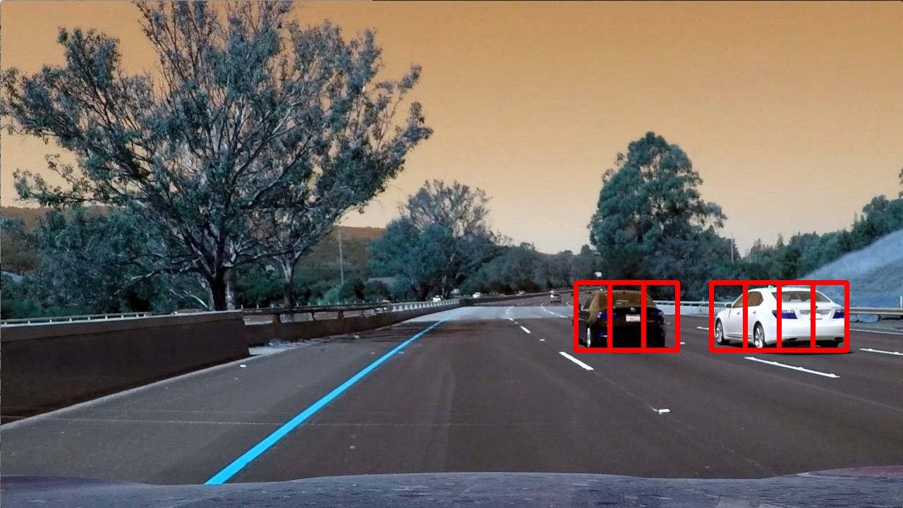 |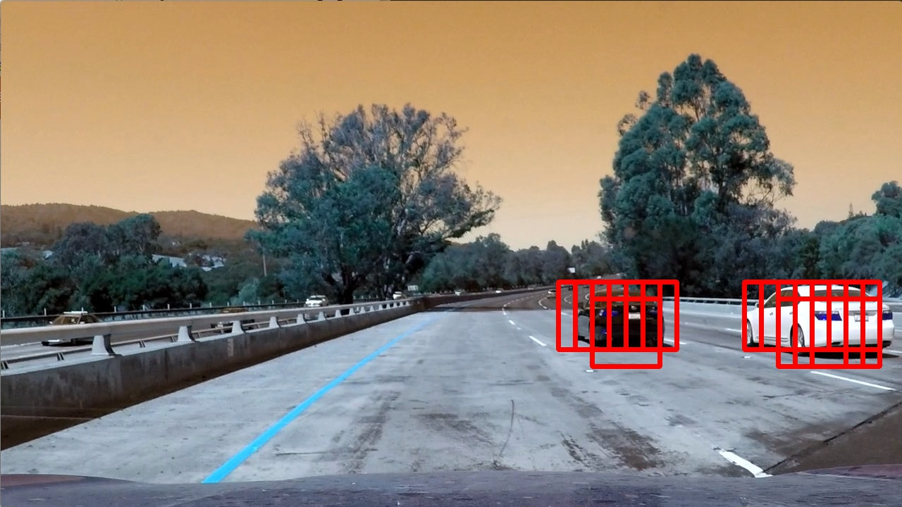 |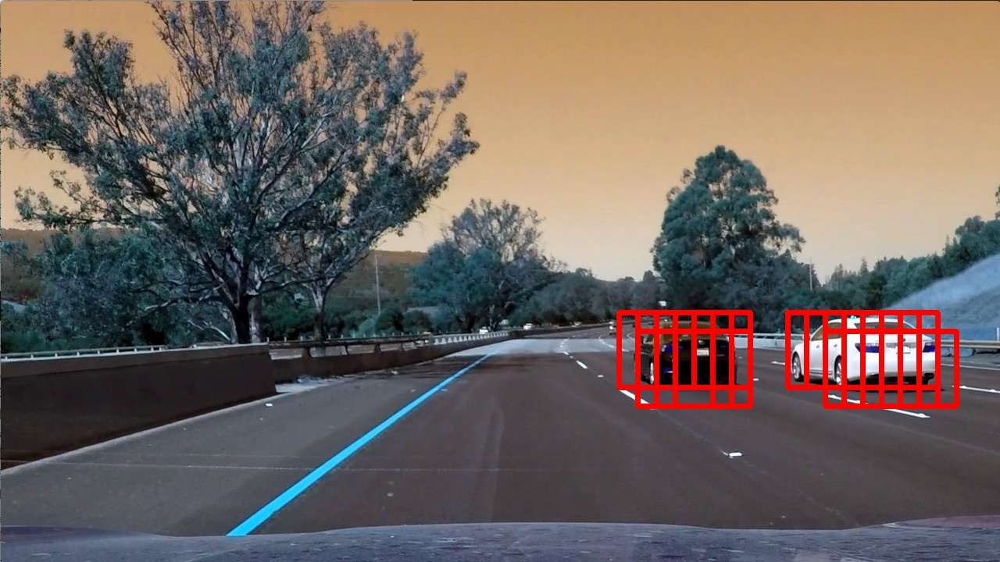 |
|Option Set 2    |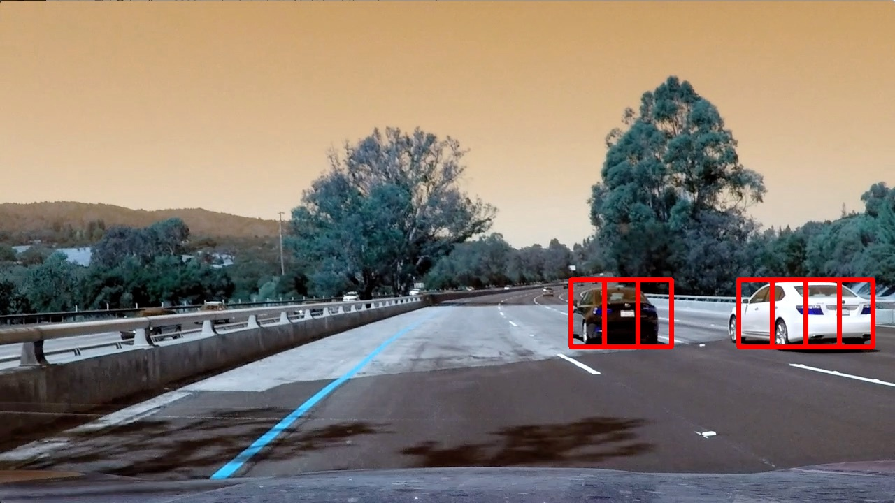 |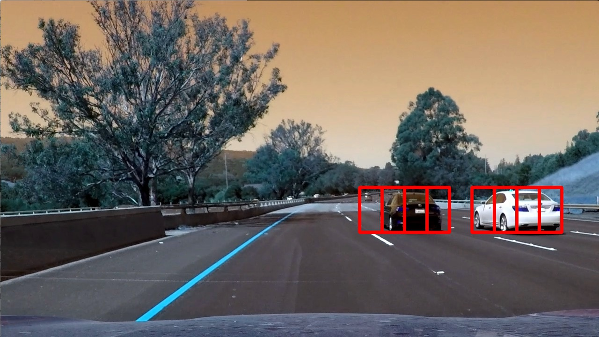 |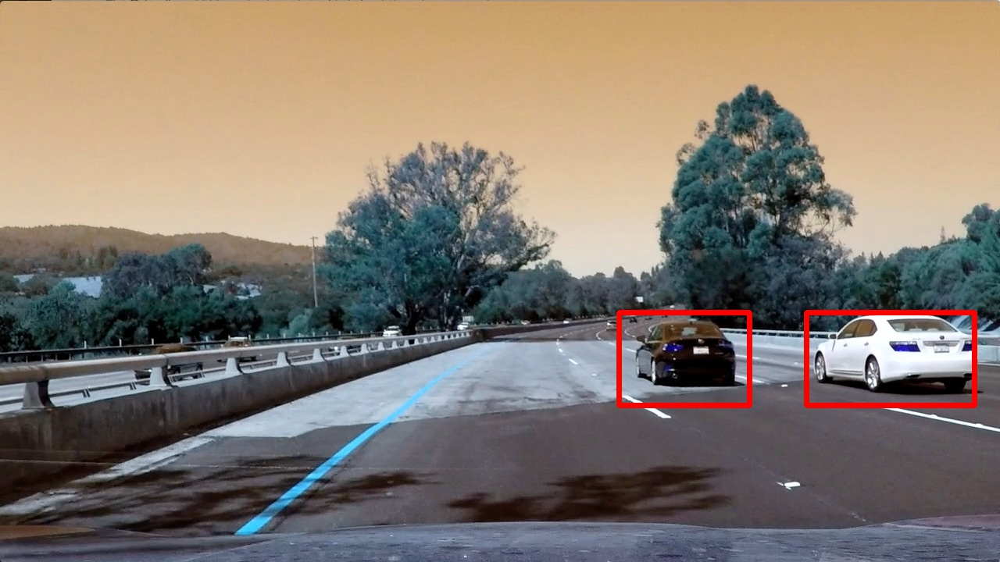 |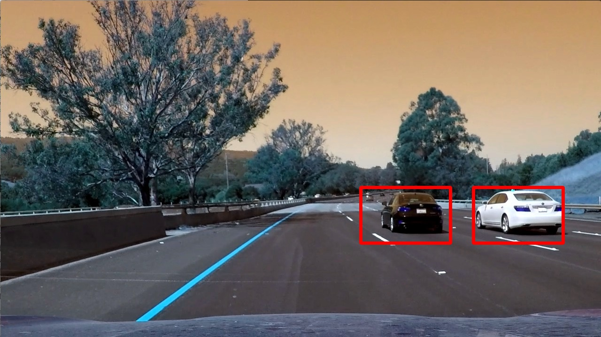 |
|Option Set 3    |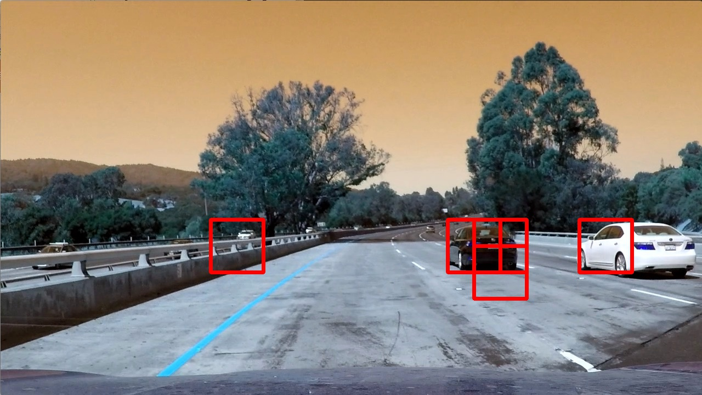 |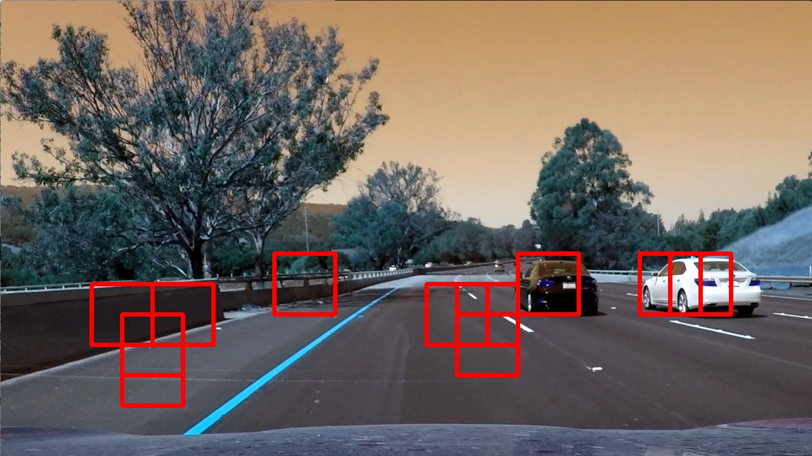 |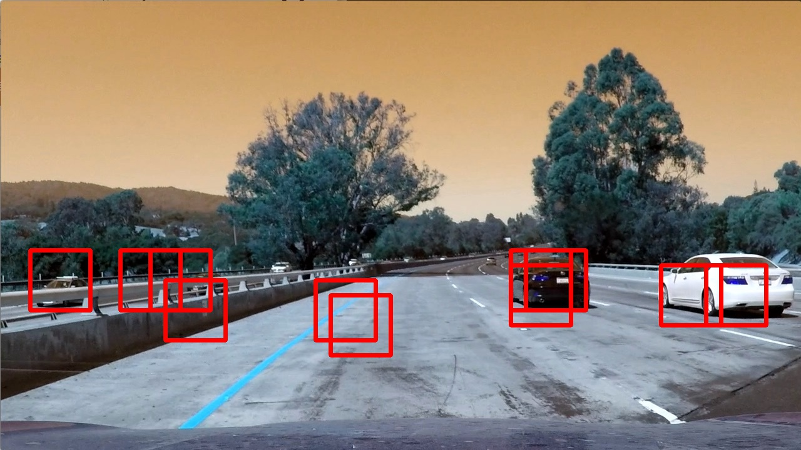 |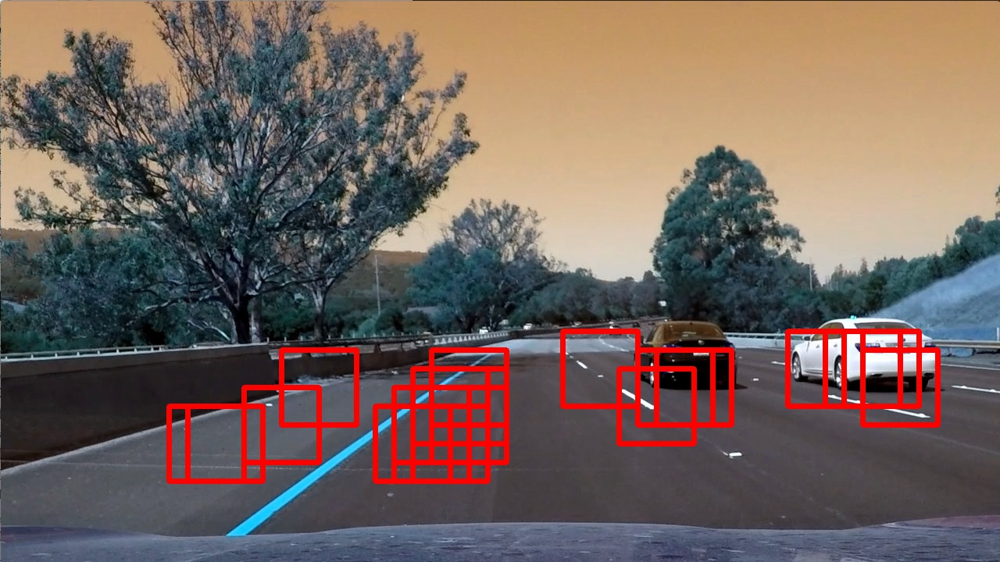 |

* `Of the above 3 - paramater set as per Option 1 was used to train the classifier as it gave maximum detections and minimun 
false positives of the three withan accuracy score of 99.27%`
* `Linear SVM classifier was used instead of Decision Tree as this project included just classifying Car or Notcar, it did not have to further decide as to what type of car it was.`

## Sliding window search and sub-sampling
A sliding window search was applied on each of the image with a window stride of 2 horizontally. HOG features were first extracted for the entire image and then sub-sampled for each block - this not only improved performance but also the nnumber of detections.

## Reducing false positives
Approaches applied to reduce false positives:
* Sliding window search was applied only in the lower half of the image, rows 400:656.
* Heatmap was constructed with all positive detections.
* Thresholding of 1-label was applied to draw the bounding box around the car.

**Bounding boxes after thresholding has been applied.**

|Sample Image     |Sample Image  |
|:-------------:|:-------------:|
|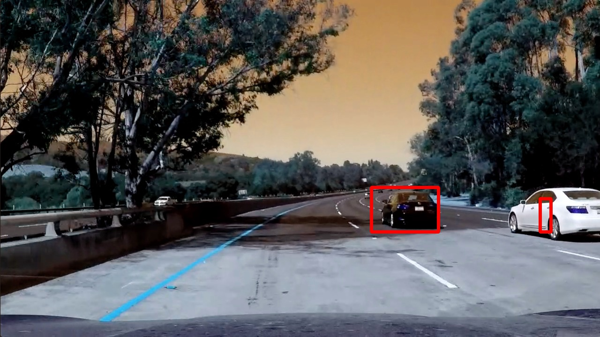 |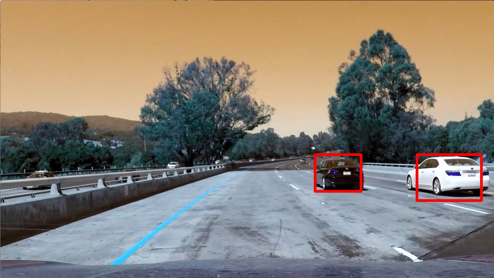  |

## Video Pipeline
The above pipeline was applied to each frame of the project_video.mp4.
Output can be 
* viewed at: https://youtu.be/xFUqHj1eV6Y or 
* downloaded from project repo: https://github.com/basurohan/CARND/blob/master/CarND-Vehicle-Detection/project_output_video.mp4. 

## Further discussions
As mentioned in the lessons this project uses traditional methods for Vehicle Detection - it is to be seen whether a better accuracy in detection can be achieved by applying Deep Learning - Neural network approach. Also, additional a smoothing factor can be applied to improve the vehicle detection (this approach also needs to be further tested). 
